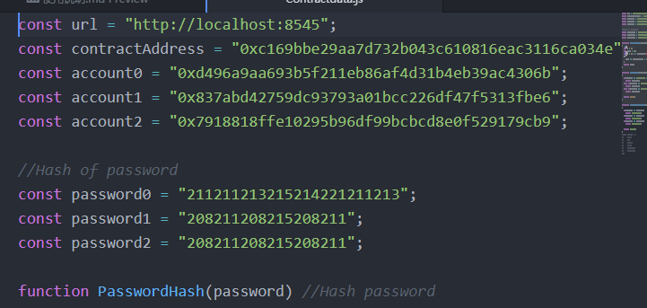
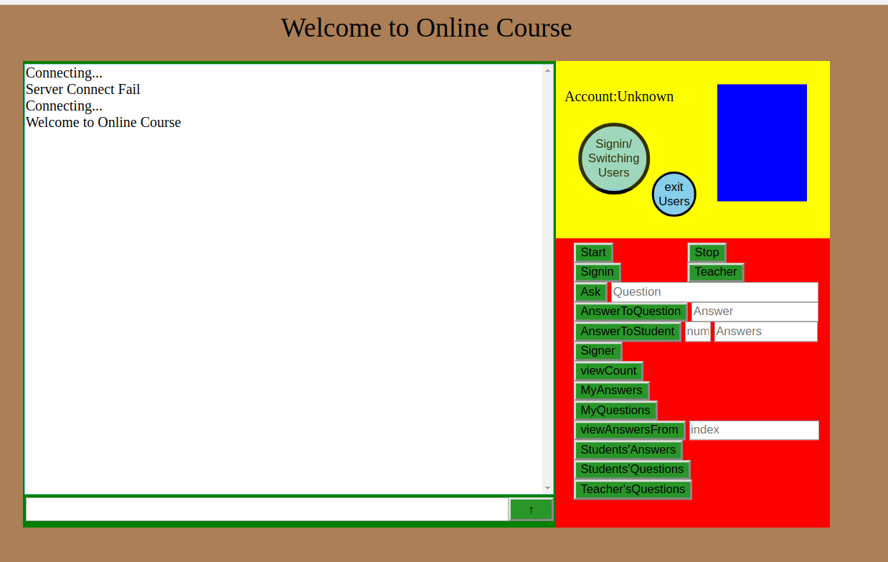

Signin 区块链网课互动系统
----------------
auther: Seya 
create at 2018/12/30 
使用语言: solidity, html, css, js

<h3>使用环境：</h3>兼容Window10 / Ubuntu17.03
<h3>网页浏览器适配：</h3>GoogleChrome浏览器、Edge浏览器
<h3>文件分布:</h3>
	【SmartContract文件夹:】 存放Solidty源代码"Signin.sol"。和webdepoly(合约部署命令) 
	【Webcode文件夹:】 存放Web源代码，"Signin.html"为主程序启动器 
	【PasswordHash文件夹:】 存放密码哈希计算器"PasswordHash.html"，用于计算密码哈希值。 
	【文档文件夹:】存放选题背景、测试、使用说明(本文件)三个文档文件。

使用前准备： 
-----------

	1.请先下载geth，创立节点，使用命令："geth --rpc --nodiscover --datadir ./nodedata0 --rpcapi "db,eth,net,web3,personal" --rpccorsdomain "*" --networkid 1001 --ipcdisable console 2>>geth.log"启动节点
	注: 默认端口：8545  
			--rpcapi "personal" 保证personal命令的使用被允许 
			--rpccorsdomain "*" 保证本地文件可被引用 
	2.将"./SmartContract/WebDepoly.log" 文件复制粘贴到geth中，完成合约部署。启动挖空，得到合约地址 

	3.将得到的合约地址，复制，并赋值给"Contractdata.js"第2行的contractAddress 

	4.由于本程序未采用数据库，因此区块链账户地址和密码需要存储到"./Webcode/js/Contractdata.js"中。同时为保障安全，密码需经过PasswordHash函数(可以使用文档提供的"PasswordHash.html"进行计算的出)，得到hash值，再将hash值赋值。如下图所示 
	注:为了方便登录，在主网页登录不再需要输入账户地址，而只需输入相应的account0、account1...即可。（目前仅支持三个账户，如有需要，可自行修改"Contractdata.js"中的代码进行扩展）

	5.在节点启动，并进行挖矿的情况下，运行"./Webcode/Signin.html"，便可进行使用。 

功能介绍： 
-------------
	1.左侧聊天框可显示系统通知，也可以进行聊天。还有两个特殊命令：输入"#clr"或者"#clear"可以清空聊天框；"#rec"或者"#reconnect"可以在与区块链断连时，重新尝试连接 

	2.Start: 开课

	3.Stop: 下课

	4.Signin: 签到，学生需要在老师开课后签到，之后才能够使用系统其它功能。否则使用无效

	5.Ask: 老师使用则可用于布置作业，所有学生可见。
	       学生使用则可用于向老师提出疑问，仅自己和老师可见。

	6.AnswerToQuestion: 学生用于回答老师提出的问题。老师也可以用于公布自己的问题的答案。

	7.AnswerToStudent: 老师用于回答学生提出的问题。"num"输入框中输入，想要回答的问题在"Students'Question"的问题队列中的序号。

	8.Signer: 可以查看已经签到的同学的用户名。

	9.viewCount: 可以查看已经签到的同学的数量。

	10.MyAnswers: 可以看自己的回答。

	11.MyQuestions: 可以看自己提出的问题，如果老师回答了你的问题，则会同时将老师的回答显示出来。

	12.viewAnswersFrom: 老师用于查看回答来自于哪个学生。index输入框中输入，"Students'Answer"的问答队列上对应的序号。

	13.Students'Answers: 查看学生的回答。

	14.Students'Question: 查看学生提出的疑问。

	15.Teacher'sQuestion: 查看老师提出的问题。

